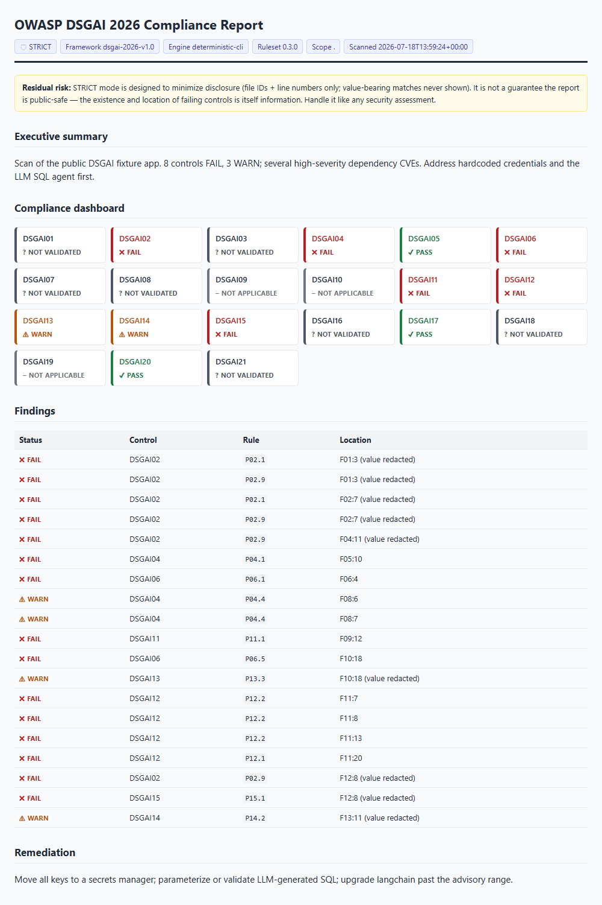

<div align="center">

# 🛡️ OWASP GenAI Data Security Initiative

**Community-developed taxonomies, crosswalks, datasets, and tooling for securing data in generative and agentic AI systems.**

Part of the [OWASP GenAI Security Project](https://genai.owasp.org/) · [Initiative Page](https://genai.owasp.org/initiative/data-security/)

[](https://genai.owasp.org/)
[](https://genai-security-project.github.io/crosswalk/)
[](https://genai.owasp.org/resource/owasp-genai-data-security-risks-mitigations-2026/)
[](https://genai-security-project.github.io/crosswalk/#/frameworks)
[](dsgai_scanner_tool/README.md)
[](https://creativecommons.org/licenses/by-sa/4.0/legalcode)
[](CONTRIBUTING.md)

[**🌐 Explore the Crosswalk webapp →**](https://genai-security-project.github.io/crosswalk/)

[White Papers](#deliverables) · [Crosswalk](#crosswalk) · [Scanner](#scanner) · [Datasets](#datasets) · [Contribute](#contribute)

</div>

---

## Overview

The OWASP GenAI Data Security Initiative addresses the data security risks unique to Large Language Models, Generative AI, and Agentic AI systems. AI introduces new data surfaces — prompts, context windows, embeddings, vector stores, agent traces, tool payloads — and new failure modes — prompt-driven extraction, cross-session bleed, inference attacks, plugin data drains — that traditional data security frameworks no longer map cleanly onto.

This initiative produces community-developed, peer-reviewed guidance, interactive tooling, and open datasets to help organizations understand and address these challenges. All materials are released under [CC BY-SA 4.0](https://creativecommons.org/licenses/by-sa/4.0/legalcode).

### At a glance

| Deliverable | What it is | Where |
| --- | --- | --- |
| 📄 **DSGAI Risk Taxonomy 2026** | 21 GenAI data security risks with tiered mitigations | [White paper](https://genai.owasp.org/resource/owasp-genai-data-security-risks-mitigations-2026/) |
| 📄 **Data Security Best Practices** | Companion implementation guide | [White paper](https://genai.owasp.org/resource/llm-and-gen-ai-data-security-best-practices/) |
| 🌐 **Framework Crosswalk** | 51 risk entries × 26 frameworks, 3,800+ control mappings, interactive webapp | [Webapp](https://genai-security-project.github.io/crosswalk/) · [Repo](https://github.com/GenAI-Security-Project/crosswalk) |
| 🛡️ **DSGAI Scanner** | Deterministic compliance scanner for AI codebases (SARIF, CI-ready) | [`dsgai_scanner_tool/`](dsgai_scanner_tool/) |
| 📊 **Community Datasets** | Exploits, vulnerabilities, test cases, incidents, traces | [`datasets/`](datasets/) |
| ✅ **Data Validation** | Schemas and checks for contributed data | [`data_validation/`](data_validation/) |
| 📚 **Literature Review** | Categorized corpus of LLM-security research papers | [`literature/`](literature/) |

---

<a id="deliverables"></a>

## 📄 Key Deliverables

### GenAI Data Security Risks and Mitigations 2026 (v1.0)

📄 [Download PDF](https://genai.owasp.org/resource/owasp-genai-data-security-risks-mitigations-2026/) · Released March 2026

A comprehensive enumeration of 21 data security risks specific to GenAI systems, each with tiered mitigations (Foundational → Hardening → Advanced) for organizations at different maturity levels. This is not a Top 10 — it is a structured risk taxonomy following data as it moves through a GenAI system.

Cross-referenced to the [OWASP Top 10 for LLM Applications](https://genai.owasp.org/llm-top-10/) and the [OWASP Top 10 for Agentic Applications 2026](https://genai.owasp.org/initiatives/agentic-security-initiative/).

<details>
<summary><strong>DSGAI Risk Taxonomy (21 entries)</strong></summary>

| ID | Risk |
| --- | --- |
| DSGAI01 | Sensitive Data Leakage |
| DSGAI02 | Agent Identity & Credential Exposure |
| DSGAI03 | Shadow AI & Unsanctioned Data Flows |
| DSGAI04 | Data, Model & Artifact Poisoning |
| DSGAI05 | Data Integrity & Validation Failures |
| DSGAI06 | Tool, Plugin & Agent Data Exchange Risks |
| DSGAI07 | Data Governance, Lifecycle & Classification for AI Systems |
| DSGAI08 | Non-Compliance & Regulatory Violations |
| DSGAI09 | Multimodal Capture & Cross-Channel Data Leakage |
| DSGAI10 | Synthetic Data, Anonymization & Transformation Pitfalls |
| DSGAI11 | Cross-Context & Multi-User Conversation Bleed |
| DSGAI12 | Unsafe Natural-Language Data Gateways (LLM-to-SQL/Graph) |
| DSGAI13 | Vector Store Platform Data Security |
| DSGAI14 | Excessive Telemetry & Monitoring Leakage |
| DSGAI15 | Over-Broad Context Windows & Prompt Over-Sharing |
| DSGAI16 | Endpoint & Browser Assistant Overreach |
| DSGAI17 | Data Availability & Resilience Failures in AI Pipelines |
| DSGAI18 | Inference & Data Reconstruction |
| DSGAI19 | Human-in-the-Loop & Labeler Overexposure |
| DSGAI20 | Model Exfiltration & IP Replication |
| DSGAI21 | Disinformation & Integrity Attacks via Data Poisoning |

Each entry follows a consistent structure: attack scenario in GenAI-specific terms, attacker capabilities, impact, and tiered mitigations with scope annotations (Buy / Build / Both).

</details>

### LLM and GenAI Data Security Best Practices 2025 (v1.0)

📄 [Download PDF](https://genai.owasp.org/resource/llm-and-gen-ai-data-security-best-practices/) · Released February 2025

The companion implementation guide covering data security principles, secure deployment architectures, monitoring and auditing guidelines, governance models, and future trends. Topics include data minimization, encryption strategies, access control for LLM pipelines, securing data flows in LLM agents, and regulatory compliance alignment.

---

<a id="crosswalk"></a>

## 🌐 Framework Crosswalk

The initiative's flagship interactive deliverable: **51 risk entries** across four OWASP source lists — LLM Top 10 2026, Agentic Top 10 2026, DSGAI 2026, and Agentic Skills Top 10 — mapped to **26 industry frameworks** through **3,800+ individual control mappings**, with **131 tracked AI security incidents**.

> ### [🚀 Open the Crosswalk webapp](https://genai-security-project.github.io/crosswalk/)
>
> | Feature | What it does |
> | --- | --- |
> | [**Score Your Coverage**](https://genai-security-project.github.io/crosswalk/#/score) | Select your frameworks, see your GenAI risk coverage gaps, validate with Garak/PyRIT results |
> | [**Explorer**](https://genai-security-project.github.io/crosswalk/#/explorer) | Search and filter all 51 entries; view mapped controls across every framework |
> | [**Coverage Matrix**](https://genai-security-project.github.io/crosswalk/#/frameworks) | Interactive 51 × 26 matrix — click any cell for the specific controls |
> | [**Incidents**](https://genai-security-project.github.io/crosswalk/#/incidents) | Real-world AI security incidents, filterable by severity, year, and layer |
> | [**Submit a Standard**](https://genai-security-project.github.io/crosswalk/#/submit) | Propose any framework for automated mapping |

Crosswalk source data, per-framework compliance gap reports (Markdown, CSV, JSON, OSCAL), and enterprise exports (STIX 2.1, OSCAL Component Definition) are maintained in the dedicated [`GenAI-Security-Project/crosswalk`](https://github.com/GenAI-Security-Project/crosswalk) repository.

**Frameworks covered:**

- **AI governance & regulation** — NIST AI RMF 1.0 · ISO/IEC 42001 · EU AI Act · ENISA Multilayer Framework · AIUC-1 · CoSAI *(candidate)* · EU AI Act Code of Practice *(candidate)*
- **Security management & compliance** — ISO/IEC 27001 · NIST CSF 2.0 · SOC 2 · PCI DSS v4.0 · CIS Controls v8.1 · FedRAMP
- **Threat modeling & adversarial** — MITRE ATLAS · MAESTRO (CSA) · STRIDE · CWE/CVE
- **Testing & verification** — OWASP ASVS · OWASP AISVS 1.0 · OWASP AI Testing Guide
- **Secure SDLC, identity & maturity** — NIST SP 800-218A · OWASP SAMM · OWASP NHI Top 10
- **OT/ICS & financial resilience** — ISA/IEC 62443 · NIST SP 800-82 Rev 3 · DORA

---

<a id="scanner"></a>

## 🛡️ DSGAI Scanner

**v0.3.0** · [`dsgai_scanner_tool/`](dsgai_scanner_tool/) — audits GenAI and agentic codebases against all 21 DSGAI controls.

A **deterministic engine** owns the pattern matching — 107 PCRE rules run via ripgrep produce identical findings on identical input, so you get a reproducible compliance artifact rather than an LLM opinion. An optional [Claude Code](https://www.anthropic.com/claude-code) skill orchestrates the run and writes the narrative report.

- 🎯 **Deterministic & reproducible** — a compliance report you can diff; secrets never leave your machine
- 🌐 **Multi-language** — Python, JavaScript/TypeScript, Java, Kotlin, Go, plus credential coverage for C#, Rust, Ruby
- 🐛 **CVE enrichment without hallucination** — queries OSV (+ NVD for CVSS) per pinned dependency across 6 ecosystems
- 🧰 **Meets your toolchain** — SARIF 2.1.0 for GitHub Code Scanning, a [Semgrep rule-pack export](dsgai_scanner_tool/dist/dsgai.semgrep.yaml), and a [gitleaks pack](dsgai_scanner_tool/integrations/gitleaks/dsgai.toml) for pre-commit
- 💸 **$0 CI path** — the CLI needs only Python 3.10+ and ripgrep; no LLM, no account

```bash
git clone --depth 1 https://github.com/GenAI-Security-Project/GenAI-Data-Security-Initiative
python GenAI-Data-Security-Initiative/dsgai_scanner_tool/cli/dsgai_scan.py scan . \
  --sarif DSGAI-scan.sarif --json-out DSGAI-scan.json
```

<details>
<summary><strong>Sample report</strong></summary>



</details>

See the [scanner README](dsgai_scanner_tool/README.md) for the full feature set, CI/CD integration, and the Claude Code skill.

---

<a id="datasets"></a>

## 📊 Community Datasets

Open, community-contributed datasets for research, benchmarking, and security testing — every entry mapped to the DSGAI taxonomy and validated before merge. See [`datasets/`](datasets/) and [CONTRIBUTING.md](CONTRIBUTING.md).

| Dataset | Contents | Status |
| --- | --- | --- |
| [Exploit Dataset](datasets/exploit_dataset/) | Documented exploit techniques targeting LLM applications, keyed to MITRE ATLAS | ✅ 59 entries |
| [Vulnerability Dataset](datasets/vulnerability_dataset/) | Real-world CVEs affecting LLM applications | ✅ 47 entries |
| [Risk Assessment Dataset](datasets/riskassessment_dataset/) | Mapped risk assessments for LLM deployments | ✅ 23 entries |
| [Prompt Injection & Data Extraction Test Cases](datasets/promptinj_dataextraction_testcases/) | Adversarial prompts and extraction techniques for red-teaming and regression testing | ✅ 300+ cases |
| [RAG Poisoning & Retrieval Integrity](datasets/rag_dataset/) | Synthetic poisoning fixtures for testing vector store integrity and retrieval filtering | 🌱 growing — contribute |
| [Incident Dataset](datasets/incident_dataset/) | Anonymized real-world GenAI data security incidents | 🙋 seeking contributors |
| [Agent Data Flow & Tool Exchange Traces](datasets/agentdataflow_toolexchange_traces/) | Sanitized traces of agent tool calls and plugin data exchanges (DSGAI06) | 🙋 seeking contributors |
| [Cross-Framework Mapping Dataset](datasets/crossframework_mapping_dataset/) | Machine-readable DSGAI-to-framework control mappings | ↗ maintained in the [crosswalk repo](https://github.com/GenAI-Security-Project/crosswalk) |

Contributions to every dataset are validated by the schemas and checks in [`data_validation/`](data_validation/) — see the [setup guide](data_validation/SETUP.md).

---

## 🗺️ Repository Map

```text
├── datasets/                ← community datasets (8 tracks, one entry per file)
├── data_validation/         ← JSON schemas + validation pipeline for contributions
├── dsgai_scanner_tool/      ← DSGAI Scanner v0.3.0 (deterministic CLI + Claude Code skill)
├── literature/              ← categorized LLM-security literature corpus
├── CONTRIBUTING.md          ← contribution paths by role and workstream
└── SECURITY.md              ← vulnerability reporting policy
```

---

## 🧭 Workstreams

| # | Workstream | Focus |
| --- | --- | --- |
| 1 | **Data Collection** | Open call for real-world vulnerability data and incident reports — submit via [Slack](https://owasp.slack.com) or a GitHub issue |
| 2 | **Framework Crosswalk** | Mapping OWASP GenAI risk lists to industry frameworks — see the [webapp](https://genai-security-project.github.io/crosswalk/) and [crosswalk repo](https://github.com/GenAI-Security-Project/crosswalk) |
| 3 | **Risks & Best Practices** | Research, authoring, and maintenance of the initiative's white papers |
| 4 | **Community Datasets** | Building the open datasets above — schemas, curation, review |
| 5 | **Data Validation** | Automated and peer-reviewed validation of all contributed data |

---

## 🤝 AI Risk Database Collaboration

The initiative collaborates with leading AI risk authorities to consolidate efforts and avoid fragmented approaches to risk identification:

- [MIT AI Risk Repository](https://airisk.mit.edu/)
- [MITRE ATLAS](https://atlas.mitre.org/)
- [NIST AI Risk Management Framework](https://www.nist.gov/itl/ai-risk-management-framework)

Community members are encouraged to report new GenAI data security risks to these organizations as well as to this initiative.

---

<a id="contribute"></a>

## 🙌 How to Contribute

All contributions are welcome — from security practitioners, AI engineers, researchers, compliance professionals, and anyone working to secure GenAI systems.

- 💬 **Slack:** Join `#team-genai-data-security-initiative` on the [OWASP Slack workspace](https://owasp.slack.com) · [New to OWASP Slack? Join here](https://owasp.org/slack/invite)
- 🧑‍💻 **GitHub:** Submit issues or pull requests — [CONTRIBUTING.md](CONTRIBUTING.md) has starting points for every role and experience level
- 🔒 **Security:** Report vulnerabilities via [GitHub Private Vulnerability Reporting](https://github.com/GenAI-Security-Project/GenAI-Data-Security-Initiative/security/advisories/new) — see [SECURITY.md](SECURITY.md) · researchers are credited in [SECURITY-THANKS.md](SECURITY-THANKS.md)
- ✉️ **Contact:** Reach out to Emmanuel Guilherme Junior (Initiative Lead) via [Slack](https://owasp.slack.com) or [LinkedIn](https://www.linkedin.com/in/emmanuelgjr/)

---

## 🧩 OWASP GenAI Security Project — Initiatives

This initiative is one of several under the [OWASP GenAI Security Project](https://genai.owasp.org/):

| Initiative | Description | Link |
| --- | --- | --- |
| **Agentic App Security** | Securing autonomous and agentic AI systems, including the Top 10 for Agentic Applications 2026 | [Initiative Page](https://genai.owasp.org/initiatives/agentic-security-initiative/) |
| **AI Red Teaming & Evaluation** | Methodology, benchmarks, and tools for adversarial testing of GenAI systems | [Initiative Page](https://genai.owasp.org/initiatives/#ai-redteaming) |
| **AI Security Solutions Landscape** | Vendor-agnostic mapping of the GenAI security tooling ecosystem | [Solutions Directory](https://genai.owasp.org/ai-security-solutions-landscape/) |
| **AIBOM Generator** | Open-source tool for generating AI Bills of Materials for supply chain transparency | [Initiative Page](https://genai.owasp.org/ai-sbom-initiative/) |
| **Data Security** | GenAI data security risks, mitigations, best practices, and framework crosswalks *(this initiative)* | [Initiative Page](https://genai.owasp.org/initiative/data-security/) |
| **Governance Checklist (COMPASS)** | Cybersecurity and governance checklist for LLM and GenAI deployments | [Resource Page](https://genai.owasp.org/resource/llm-applications-cybersecurity-and-governance-checklist-english/) |
| **Secure AI Adoption** | Center of Excellence guidance for safe, ethical, and secure organizational AI adoption | [Initiative Page](https://genai.owasp.org/initiatives/#secure-ai-adoption) |
| **Threat Intelligence** | Research into LLM-enabled exploit generation and deepfake threat preparation | [Initiative Page](https://genai.owasp.org/initiatives/#ai-threat-intel) |

---

## 🙏 Acknowledgments

**Initiative Lead:** [Emmanuel Guilherme Junior](https://www.linkedin.com/in/emmanuelgjr/)

This initiative is made possible by the contributions of its authors, contributors, and reviewers from across the global AI security community. Thank you to everyone who has helped build and shape this community resource. Full contributor lists are included in each published document.

---

## 📜 License

All materials produced by this initiative are licensed under [Creative Commons Attribution-ShareAlike 4.0 International (CC BY-SA 4.0)](https://creativecommons.org/licenses/by-sa/4.0/legalcode).

You are free to share and adapt the material for any purpose, including commercial, under the following terms: provide appropriate attribution including the project name and asset name, and distribute any derivative works under the same license.
