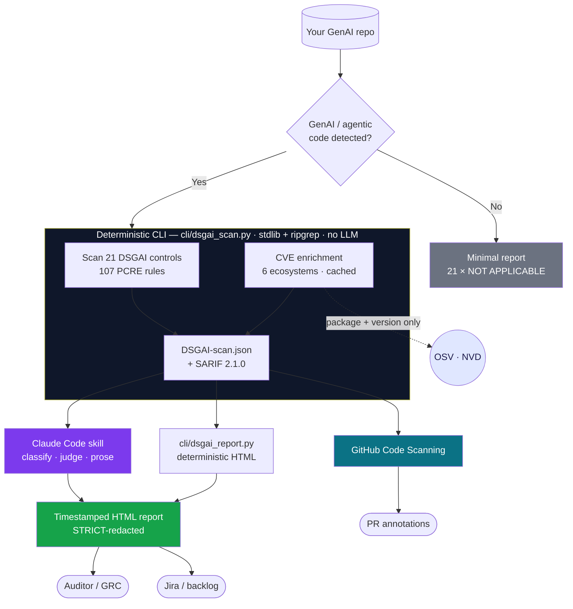

<div align="center">

# 🛡️ DSGAI Scanner

**OWASP GenAI Data Security compliance scanning for AI &amp; agentic codebases**

Audits your GenAI app against all **21 controls** of the [OWASP GenAI Data Security Risks &amp; Mitigations 2026](https://genai.owasp.org/resource/owasp-genai-data-security-risks-mitigations-2026/) framework. A **deterministic engine** owns the pattern matching, so results are reproducible and secrets never leave your machine — the LLM only orchestrates and writes prose.

[](https://genai.owasp.org/initiative/data-security/)
[](https://genai.owasp.org/resource/owasp-genai-data-security-risks-mitigations-2026/)
[](./CHANGES_v0.3.md)
[](../.github/workflows/scanner-selftest.yml)
[](#cicd-and-code-scanning)
[](#license)

[Quick start](#quick-start) · [How it works](#how-it-works) · [Features](#features) · [Usage](#usage) · [CI/CD](#cicd-and-code-scanning) · [The report](#the-report) · [Contributing](#contributing)

</div>

---

Most scanners either miss GenAI-specific risk (generic SAST) or hand the judgment to an LLM that produces a different answer every run. **DSGAI Scanner splits the job:** a single-file, dependency-free Python CLI (`cli/dsgai_scan.py`) runs 107 PCRE rules over your code via [ripgrep](https://github.com/BurntSushi/ripgrep) and emits identical findings every time; the [Claude Code](https://www.anthropic.com/claude-code) skill orchestrates the run, classifies ambiguous cases, and renders the report. You get a **reproducible compliance artifact** — and, if you want it, a $0 LLM-free path that drops straight into CI as SARIF.

<details>
<summary><b>Table of contents</b></summary>

- [Quick start](#quick-start)
- [How it works](#how-it-works)
- [Features](#features)
- [The 21 DSGAI controls](#the-21-dsgai-controls)
- [Usage](#usage)
- [CI/CD &amp; Code Scanning](#cicd-and-code-scanning)
- [The report](#the-report)
- [How redaction works](#how-redaction-works)
- [Reference](#reference) — checkpoint file · PDF export · scope annotation · remediation tiers
- [Cost &amp; runtime](#cost-and-runtime)
- [Contributing](#contributing) · [Non-goals](#non-goals)
- [License &amp; attribution](#license)

</details>

## Quick start

**Deterministic CLI — $0, no LLM, no account.** Reproducible findings + SARIF in seconds. Needs only Python 3.10+ and ripgrep with PCRE2.

```bash
git clone --depth 1 https://github.com/GenAI-Security-Project/GenAI-Data-Security-Initiative
python GenAI-Data-Security-Initiative/dsgai_scanner_tool/cli/dsgai_scan.py scan . \
  --sarif DSGAI-scan.sarif --json-out DSGAI-scan.json
```

**Claude Code skill — full report with narrative + remediation.**

```bash
# 1. Install the skill
curl -fsSL https://raw.githubusercontent.com/GenAI-Security-Project/GenAI-Data-Security-Initiative/main/dsgai_scanner_tool/dsgai_scanner_tool.md \
  -o ~/.claude/commands/dsgai_scanner_tool.md

# 2. Scan your repo
cd ~/my-genai-app && claude
/dsgai_scanner_tool

# 3. Open the timestamped report
open dsgai-reports/DSGAI-report-*.html        # macOS  (xdg-open on Linux, start on Windows)
```

> [!TIP]
> Check your environment first with `python cli/dsgai_scan.py doctor` — it verifies Python, ripgrep + PCRE2, and that the ruleset loads.

## How it works

The deterministic CLI does all pattern matching and CVE lookups; the skill (or the CI's report renderer) turns the checkpoint into a report. Nothing but package names + versions ever leaves your machine.



**Value-bearing rules never surface the secret.** Credential/PII patterns run through ripgrep in erase-the-match mode (`rg -o --replace ''`), so the matched value is destroyed *inside ripgrep* before anything is emitted — it cannot reach the report, the checkpoint, or a tool call. See [How redaction works](#how-redaction-works).

## Features

| | |
|---|---|
| 🎯 **Deterministic engine** | 107 PCRE rules, run via `rg --pcre2`. Identical findings on identical input — a compliance report you can diff, not an LLM opinion. |
| 🔒 **Redaction by construction** | Value-bearing matches are erased inside ripgrep; the checkpoint schema *forbids* content fields (machine-checked). |
| 🧾 **SARIF 2.1.0 → Code Scanning** | Native GitHub Code Scanning annotations on changed lines, plus a portable artifact. |
| 🐛 **CVE enrichment, no hallucination** | The CLI queries OSV (+ NVD for CVSS) per pinned version across **6 ecosystems**; the LLM never transcribes CVE data. Cached, offline-capable. |
| 🌐 **Multi-language** | Python, JS/TS, Java, Kotlin, Go, and credential coverage for **C#, Rust, Ruby**. |
| 🧰 **Ships with the ecosystem** | A [gitleaks](integrations/gitleaks/dsgai.toml) rule pack and a [Semgrep](dist/dsgai.semgrep.yaml) export so incumbent toolchains carry the framework. |
| 🎚️ **Team-scale controls** | Inline `# dsgai-ignore` suppressions (with reasons), a **baseline** so CI gates only on new findings, and incremental `--diff` scans. |
| ✅ **Tested & gated** | A public [vulnerable fixture app](tests/fixtures/vulnerable-app/) with a line-pinned answer sheet and a CI self-test that makes external rule PRs safe to merge. |
| 🗣️ **Honest reporting** | STRICT mode renders stable file IDs, never the secret; the report declares its own residual risk instead of implying it can be published as-is. |

### The 21 DSGAI controls

<details>
<summary>Every control is rated <b>PASS / WARN / FAIL / NOT VALIDATED / NOT APPLICABLE / VENDOR ATTESTATION REQUIRED</b> — click to expand the full list.</summary>

| Risk | Control | Responsibility |
|---|---|---|
| DSGAI01 | Training Data Privacy | BOTH |
| DSGAI02 | Agentic Identity &amp; Credential Management | BUILD |
| DSGAI03 | Shadow AI &amp; Unauthorized Data Flows | BOTH |
| DSGAI04 | AI Supply Chain Security | BUILD |
| DSGAI05 | RAG Data Security | BUILD |
| DSGAI06 | MCP &amp; Plugin Security | BUILD |
| DSGAI07 | Data Lifecycle Management | BUILD |
| DSGAI08 | Regulatory &amp; Privacy Compliance | BOTH |
| DSGAI09 | Multimodal AI Data Security | BOTH |
| DSGAI10 | Synthetic Data Security | BUILD |
| DSGAI11 | Multi-Tenant Data Isolation | BUILD |
| DSGAI12 | Database Agent Security | BUILD |
| DSGAI13 | Vector Store Security | BUILD |
| DSGAI14 | AI Telemetry &amp; Observability Security | BUILD |
| DSGAI15 | Context Window Data Security | BUILD |
| DSGAI16 | AI IDE Plugin &amp; Extension Security | BUILD |
| DSGAI17 | AI System Resilience &amp; Availability | BUILD |
| DSGAI18 | Model Output Data Security | BUILD |
| DSGAI19 | AI Data Labeling Security | BUILD |
| DSGAI20 | Inference API Security | BOTH |
| DSGAI21 | Knowledge Store Security | BUILD |

**[BUILD]** you implement (scanned mechanically) · **[BUY]** the vendor is responsible (emits a *Vendor Attestation Required* callout) · **[BOTH]** shared. See the **Reference → Scope annotation** section below.

</details>

## Usage

### Deterministic CLI

`cli/dsgai_scan.py` is a single stdlib-only file that shells out to ripgrep. Subcommands:

| Command | What it does |
|---|---|
| `scan [path]` | Run the ruleset; emit `DSGAI-scan.json`, SARIF, and/or a table. |
| `detect [path]` | Exit 0 if the repo contains GenAI/agentic signals, 1 otherwise. |
| `doctor` | Check Python, ripgrep + PCRE2, and that the ruleset loads. |
| `baseline [path]` | Snapshot current findings to a baseline file. |
| `cve [path]` | CVE enrichment only, from dependency manifests. |

Key `scan` flags (all combinable):

| Flag | Effect |
|---|---|
| `--sarif FILE` | Write SARIF 2.1.0 for GitHub Code Scanning. |
| `--json-out FILE` | Write the `DSGAI-scan.json` checkpoint. |
| `--internal` | Render full paths (default STRICT renders file IDs). |
| `--scope PATH` | Restrict the scan to a sub-directory. |
| `--exclude PATH` | Exclude a path/glob (repeatable). |
| `--diff REF` | Incremental: only files changed vs `REF`. |
| `--baseline FILE` | Gate only on findings **not** in the baseline. |
| `--no-cve` / `--offline` / `--refresh-cve` | Control CVE enrichment &amp; caching. |
| `--fail-on {fail,warn}` | Exit non-zero at this threshold (CI gating). |

Suppress a finding inline (a reason is required, and it stays visible in a *Suppressed* section):

```python
db.execute(query)  # dsgai-ignore: P12.1 reason="reviewed 2026-07 — ORM param binding"
```

### Claude Code skill

The skill prefers the bundled CLI and falls back to an in-context scan if it isn't present; the report header names which engine ran.

| Command | What it does |
|---|---|
| `/dsgai_scanner_tool` | Full scan. STRICT redaction, CVE enrichment, whole repo. |
| `/dsgai_scanner_tool --internal` | Full file paths (team-internal report). |
| `/dsgai_scanner_tool --no-cve` | Skip CVE lookups (air-gapped / offline). |
| `/dsgai_scanner_tool --scope app/agents/` | Scan one sub-directory (monorepos). |
| `/dsgai_scanner_tool --diff main --baseline dsgai-baseline.json` | Incremental, gated on new findings. |

### Other AI coding tools

The tool-neutral variant [`dsgai_scanner_prompt.md`](dsgai_scanner_prompt.md) is generated from the skill (so the two never drift) and works with any assistant that can run shell commands — Cursor, Copilot Chat, ChatGPT, Gemini. Paste it as instructions and give the model access to your files and a shell.

## CI/CD and Code Scanning

### GitHub Action — [`integrations/dsgai-scan.yml`](integrations/dsgai-scan.yml)

A hardened, **two-job** workflow. The design keeps secrets away from any job that reads untrusted code:

- **`scan`** — runs the **deterministic CLI only**: no LLM, no API key, no network egress with a secret. Safe on fork PRs. Uploads **SARIF to Code Scanning** (same-repo) and the checkpoint as an artifact.
- **`narrate`** — renders the HTML report **deterministically** (`cli/dsgai_report.py`); no LLM, no secret either.

All third-party actions are **pinned by commit SHA**. Gating is **report-only by default** — set the repo variable `DSGAI_FAIL_ON` to `fail` or `warn` to break the build. No `ANTHROPIC_API_KEY` is required.

> [!IMPORTANT]
> CI always scans in STRICT mode (file IDs, never full paths or values). Don't pass `--internal` in a workflow whose artifacts or logs are visible beyond your team.

### Pre-commit — gitleaks pack + portable fallback

Block hardcoded credentials before they land. Recommended path is the [gitleaks rule pack](integrations/gitleaks/dsgai.toml) (entropy-aware, cross-platform); a zero-dependency [ripgrep script](integrations/dsgai-secret-scan.sh) is provided as a bash-3.2-safe fallback. See [`integrations/pre-commit-hook.md`](integrations/pre-commit-hook.md).

### Semgrep pack

[`dist/dsgai.semgrep.yaml`](dist/dsgai.semgrep.yaml) exports the STRUCTURAL rules as a Semgrep pack — run the DSGAI framework inside a toolchain you already have.

## Why this scanner

It's built to *complement* the tools you already run, not replace them — it even ships packs for them.

- **Framework-native.** The reference implementation of the OWASP GenAI Data Security 2026 framework, maintained inside the initiative that authors it. Findings map 1:1 to the 21 controls, so the report reads as compliance evidence, not generic lint output.
- **Deterministic where it matters.** Pattern matching, CVE lookup, and report structure are code (stdlib CLI + ripgrep) — not model output. Identical input yields byte-identical findings, and every rule is data pinned to a known-answer fixture corpus. The optional LLM layer only adds prose; it never decides what was found.
- **Redaction by construction, not by policy.** Value-bearing rules erase the match inside ripgrep, and the checkpoint schema formally forbids content fields — so the guarantee is machine-checked in CI, not left to discipline.
- **GenAI-specific depth, not SAST breadth.** Vector-store auth, RAG access control, MCP transport, prompt-logging PII, unsafe model deserialization, agentic credential handling — patterns general rulesets don't carry.
- **Feeds your toolchain.** SARIF into GitHub Code Scanning; exported Semgrep and gitleaks packs so the framework rides tools you already operate.

## The report

<p align="center">
  
  <br>
  <em>Rendered deterministically by <code>cli/dsgai_report.py</code> from a scan of the public <a href="tests/fixtures/vulnerable-app/">fixture app</a> — STRICT mode, file IDs + line numbers only, zero real-repo disclosure. Fully reproducible.</em>
</p>

The self-contained HTML report (no CDN, no external fonts; prints cleanly to PDF) contains:

- **Executive summary** &amp; an **obfuscation-mode badge** (🛡️ STRICT / 🔓 INTERNAL)
- **Compliance dashboard** — counts across all 21 controls; every status carries a symbol + text label, not colour alone
- **AI component inventory** — detected frameworks, vector stores, LLM providers, MCP servers
- **MITRE ATLAS techniques** relevant to the detected stack (from a versioned [static map](rules/atlas-map.yaml))
- **Findings** — one card per risk with locations, line numbers, and tiered remediation
- **CVE advisory panel** — advisories for your exact dependency versions, grouped by DSGAI risk
- **Compliance checklist** mappable to GDPR, EU AI Act, SOC 2, ISO 42001

> [!WARNING]
> **Residual risk.** STRICT mode is designed to *minimize* disclosure — file IDs + line numbers only, value-bearing matches never shown. It does **not** make the report public-safe: the existence and location of failing controls is itself information. Handle it like any security assessment.

## How redaction works

The redaction guarantee is **structural**, not a matter of remembering to be careful:

1. **Location-only matching.** Value-bearing rules (DSGAI02/13/14/15 — credentials, vector-store tokens, telemetry PII, system-prompt secrets) run `rg -o --replace ''`. Ripgrep erases the matched text *before it emits anything*, so the output is `path:line:` — the secret never leaves the ripgrep process.
2. **Stable file IDs in STRICT mode.** Findings render as `F07:12`; the `F## → path` map is written to a **gitignored** `DSGAI-filemap.json` that is never embedded in the report.
3. **A schema that forbids leakage.** [`schemas/dsgai-scan.schema.json`](schemas/dsgai-scan.schema.json) rejects any finding carrying `match_text`, `content`, `value`, or `raw_grep_output`, and the CLI self-validates before writing. The guarantee is machine-checked by CI.

## Reference

<details>
<summary><b>Checkpoint file</b> — <code>DSGAI-scan.json</code></summary>

The CLI writes a schema-validated checkpoint alongside the report: framework/ruleset versions, per-control statuses, findings (control, rule ID, rendered path, line, status), suppressed findings, and CVEs. It carries **no** match content by construction. In STRICT mode it holds file IDs, not full paths — but it still records which controls fail and where, so treat it as a security artifact (commit only if your threat model allows, or `.gitignore` it).

</details>

<details>
<summary><b>Export to PDF</b></summary>

**Browser:** open the report in Chrome/Edge → `Ctrl/Cmd+P` → Save as PDF (cards expand for print).

**Headless:**
```bash
google-chrome --headless=new --print-to-pdf=DSGAI-report.pdf \
  --print-to-pdf-no-header "file://$(pwd)/dsgai-reports/DSGAI-report-<timestamp>.html"
```

</details>

<details>
<summary><b>Scope annotation</b> — BUILD / BUY / BOTH</summary>

Each control is tagged by responsibility. **[BUILD]** controls are scanned mechanically. **[BUY]** controls (the vendor's responsibility) emit a `VENDOR ATTESTATION REQUIRED` callout listing exactly what to request (e.g. SOC 2 report, data-retention policy, rate-limit documentation). **[BOTH]** controls scan the BUILD portion and emit an attestation callout for the BUY portion. Controls with BUY aspects (DSGAI01, 08, 09, 20) consolidate into one *Vendor Attestations to Request* card.

</details>

<details>
<summary><b>Remediation tiers</b></summary>

| Tier | Meaning | Example |
|---|---|---|
| 🔴 **Tier 1** — fix today | FAIL items + exploitable CVEs | Hardcoded `sk-` key; unauthenticated vector store; unsafe `torch.load()` |
| 🟡 **Tier 2** — architecture backlog | WARN + structural gaps | Add a circuit breaker; centralize PII redaction; route via an internal LLM gateway |
| 🔵 **Tier 3** — maturity program | NOT VALIDATED (process evidence) | Quarterly red-team; complete a DPIA; commission an AppSec review |

</details>

## Cost and runtime

- **CLI-only mode: $0.** `python cli/dsgai_scan.py scan .` uses no LLM — just ripgrep. Reproducible findings + SARIF in seconds. This is what the Action runs on every PR (including forks, since it needs no secrets).
- **Skill mode:** a full scan of the fixture app renders in ~1–3 minutes in Claude Code; token cost scales with findings and report prose, not lines of code — the deterministic engine does the matching.
- Everything runs **locally**. Only package names + pinned versions go to public CVE databases, and only if you don't pass `--no-cve`.

## Contributing

> [!TIP]
> **Found a wrong result? That's a contribution.** Run the scan on your repo and file a
> [false-positive](https://github.com/GenAI-Security-Project/GenAI-Data-Security-Initiative/issues/new?template=scanner-false-positive.yml) or
> [false-negative](https://github.com/GenAI-Security-Project/GenAI-Data-Security-Initiative/issues/new?template=scanner-false-negative.yml) issue — every accepted
> report becomes a permanent, credited test case in the fixture corpus. No code required.

Detection rules live as data in [`rules/dsgai-rules.yaml`](rules/dsgai-rules.yaml) (schema-validated, compiled to JSON). To add or fix a rule, see [`rules/README.md`](rules/README.md) and the full guide in [`CONTRIBUTING.md`](CONTRIBUTING.md); the [`ROADMAP.md`](ROADMAP.md) tracks what's planned. Every rule ships with positive **and** negative fixture cases — the CI self-test is the gate.

### Non-goals

To stay maintainable and trustworthy, some things are deliberately out of scope:

- **No general-purpose secret scanning** — we ship a gitleaks pack and lean on battle-tested tooling instead.
- **No general SAST** — scope is the 21 DSGAI controls, not every code smell.
- **No rules without fixture tests** — a rule with no positive *and* negative case has no defined precision.
- **No changes that weaken the redaction guarantee** — that property is non-negotiable.

## License

Based on the **OWASP GenAI Data Security Risks and Mitigations 2026 (v1.0, March 2026)**, licensed under [Creative Commons Attribution-ShareAlike 4.0 International (CC BY-SA 4.0)](https://creativecommons.org/licenses/by-sa/4.0/legalcode). *(A split that keeps framework text under CC BY-SA 4.0 while re-licensing the executable code under Apache-2.0 is under review with OWASP leadership.)*

**Framework &amp; scanner** by the [OWASP GenAI Data Security Initiative](https://genai.owasp.org/initiative/data-security/), led by [Emmanuel Guilherme Junior](https://www.linkedin.com/in/emmanuelgjr/). v0.1 groundwork by Harish Ramachandran.

<div align="center">
<sub>Part of the OWASP GenAI Data Security Initiative · <a href="https://genai.owasp.org/initiative/data-security/">genai.owasp.org</a></sub>
</div>
