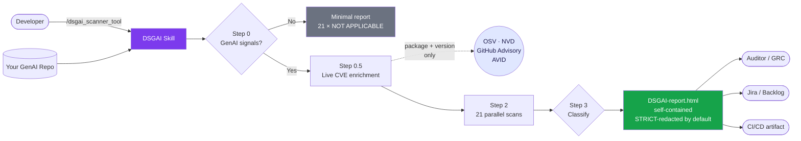
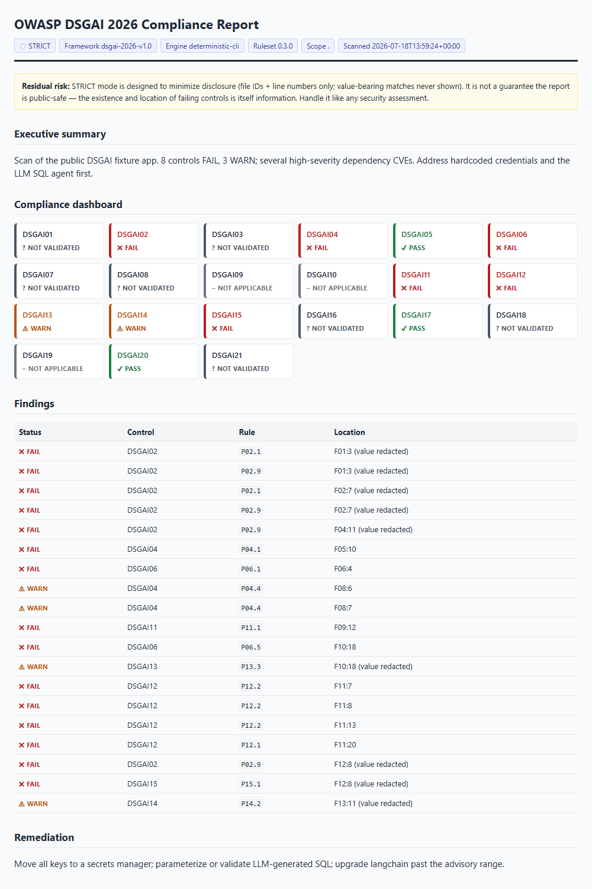

# GenAI Data Security Risks (DSGAI) Tool — OWASP GenAI Data Security Compliance Report

[](https://genai.owasp.org/initiative/data-security/)
[](https://genai.owasp.org/resource/owasp-genai-data-security-risks-mitigations-2026/)
[](./CHANGES_v0.3.md)
[](https://creativecommons.org/licenses/by-sa/4.0/)

Scans GenAI and agentic codebases against the **OWASP GenAI Data Security Risks and Mitigations 2026 (v1.0)** — all 21 DSGAI risk controls across the GenAI data lifecycle. A **deterministic CLI** (`cli/dsgai_scan.py`) owns pattern matching so results are reproducible; the **Claude Code skill** orchestrates and writes the report. The report is **strict-by-default redacted** (file IDs + line numbers only, value-bearing matches never shown) — designed to minimize disclosure. It is not automatically public-safe: the existence and location of failing controls is itself information, so handle it like any security assessment.

Part of the [OWASP GenAI Data Security Initiative](https://genai.owasp.org/initiative/data-security/).

---

## How It Works



The whole thing runs on your local machine. Source code never leaves it — only public package names + pinned versions go to public CVE databases (and only if you haven't passed `--no-cve`).

---

## Quick Start (60 seconds)

```bash
# 1. Install the skill into Claude Code
curl -fsSL https://raw.githubusercontent.com/GenAI-Security-Project/GenAI-Data-Security-Initiative/main/dsgai_scanner_tool/dsgai_scanner_tool.md \
  -o ~/.claude/commands/dsgai_scanner_tool.md   # macOS/Linux

# 2. cd into your GenAI repo and launch Claude Code
cd ~/my-genai-app
claude

# 3. Run the scan (the skill prefers the deterministic CLI if bundled)
/dsgai_scanner_tool

# 4. Open the timestamped report from dsgai-reports/
open dsgai-reports/DSGAI-report-*.html      # macOS
xdg-open dsgai-reports/DSGAI-report-*.html  # Linux
start dsgai-reports\DSGAI-report-<ts>.html  # Windows
```

**Deterministic, LLM-free option ($0):** run the CLI directly for reproducible findings + SARIF, no API cost:

```bash
python dsgai_scanner_tool/cli/dsgai_scan.py scan . --sarif DSGAI-scan.sarif
```

That's it. Full installation, flags, and CI integration are documented below.

---

## What It Does

When you run `/dsgai_scanner_tool` inside a repository, the skill:

1. **Detects** whether the repo contains GenAI/agentic patterns (LangChain, LlamaIndex, OpenAI SDK, vector stores, MCP servers, etc.) — bails out gracefully if none are found.
2. **Enriches live CVEs** by querying OSV, NVD, GitHub Advisory Database, and AVID against the exact package versions pinned in the repo (Python, JS/TS, Java, **Go**).
3. **Scans source code** for all 21 DSGAI risk indicators across all 21 controls — credentials, SQL injection via LLM output, vector store auth, telemetry logging, RAG access controls, MCP transport security, resilience, multimodal handling, synthetic data, labeling pipelines, IDE plugin scoping, and more.
4. **Generates a timestamped `dsgai-reports/DSGAI-report-<ts>.html`** — a self-contained, print-ready HTML report with findings, file locations, line numbers, remediation steps, MITRE ATLAS technique mapping, and a CVE advisory panel — **strict-by-default obfuscation designed to minimize disclosure** (share under security-assessment handling; see *Residual risk*).

**Performance:** All 21 control scans and all CVE source queries run as parallel tool calls — the skill fires multiple grep scans and API requests simultaneously rather than sequentially. Typical scan time: 2–5 minutes (in Claude Code; other AI tools may run sequentially and take longer).

---

## Privacy, Obfuscation & Data Handling

The skill runs **entirely on your local machine**. Your source code is never uploaded.

### What stays local
- All source code files scanned for security patterns
- Configuration files, secrets, environment variables
- Dependency manifests and build files

### What is sent to the internet (optional, CVE lookups only)
- Package names and version numbers (e.g. `langchain==0.1.0`) sent to public vulnerability databases
- Only these public databases: [OSV](https://osv.dev), [NVD](https://nvd.nist.gov), [GitHub Advisory Database](https://github.com/advisories), [AVID](https://avidml.org)
- No actual code, secrets, file contents, or identifying information leaves your machine
- Pass `--no-cve` to skip all network traffic — the scan falls back to the embedded CVE database

### Report obfuscation — strict by default

The report **defaults to strict mode**. The default exists because OWASP-aligned compliance reports are routinely shared with auditors, attached to tickets, and stored in public repos — and a leaked secret in a "compliance report" is worse than no report at all.

| Mode | How to invoke | What evidence shows | When to use |
|---|---|---|---|
| **🛡️ STRICT** (default) | `/dsgai_scanner_tool` | Filename + line only (`config.py:12`). Intermediate directories dropped. Value-bearing matches (credentials, tokens, PII in logs) NEVER displayed, even with `--internal`. | Sharing with auditors, attaching to a Jira ticket, committing the report to git, posting in Slack, archiving as compliance evidence. |
| **🔓 INTERNAL** | `/dsgai_scanner_tool --internal` | Full relative path (`app/services/agent/config.py:12`). Value-bearing matches still NEVER displayed. | Your team's working copy on a private dev machine when you want to click straight to the file. |

Value-bearing scans (DSGAI02 credentials, DSGAI13 vector store tokens, DSGAI14 telemetry PII, DSGAI15 system prompt secrets) use a six-step protocol that **never lets the matched secret value enter the report, the on-disk checkpoint, or any persistent tool call** — regardless of mode.

---

## Prerequisites

- A repository containing GenAI or agentic code (Python, TypeScript, Java, Go)
- An AI coding tool with **file reading access** to your codebase
- **Web access** for live CVE lookups (optional — pass `--no-cve` for fully offline operation)

No Python packages or external tools required to generate the HTML report.

---

## Running with Claude Code (Native)

Claude Code has first-class support for this skill via its slash command system.

**Install — macOS / Linux:**
```bash
cp dsgai_scanner_tool.md ~/.claude/commands/
```

**Install — Windows (PowerShell):**
```powershell
Copy-Item dsgai_scanner_tool.md $env:USERPROFILE\.claude\commands\
```

**Install — Windows (cmd):**
```
copy dsgai_scanner_tool.md %USERPROFILE%\.claude\commands\
```

**Usage — all flags combinable:**

| Command | What it does |
|---|---|
| `/dsgai_scanner_tool` | Default scan. STRICT obfuscation. Live CVE enrichment. Full repo. |
| `/dsgai_scanner_tool --internal` | Full file paths (team-internal report) |
| `/dsgai_scanner_tool --no-cve` | Skip live CVE lookups (air-gapped / offline) |
| `/dsgai_scanner_tool --scope app/agents/` | Only scan this sub-directory (large monorepos) |
| `/dsgai_scanner_tool --internal --no-cve --scope services/` | All three combined |

Claude scans the codebase — typically 2–5 minutes depending on repo size. A `DSGAI-report.html` file is saved at the repository root.

**Open the report:**
```bash
# macOS
open DSGAI-report.html
# Linux
xdg-open DSGAI-report.html
# Windows
start DSGAI-report.html
```

---

## Running with Other AI Coding Tools

The skill file is plain Markdown. Any AI tool with file reading access to your codebase can run it — paste the contents as your prompt.

| Tool | How to run |
|---|---|
| **Cursor** | Open `dsgai_scanner_prompt.md` (the plain-prompt variant), copy contents, paste into Cursor's AI chat |
| **GitHub Copilot Chat** | Open `dsgai_scanner_prompt.md`, copy contents, paste into Copilot Chat in VS Code with repo files as context |
| **ChatGPT / GPT-5** | Paste `dsgai_scanner_prompt.md` as the system prompt, then upload or paste the relevant source files |
| **Google Gemini** | Paste `dsgai_scanner_prompt.md` as instructions, attach source files for analysis |

> **Why a separate `dsgai_scanner_prompt.md`?** The Claude Code skill assumes specific tools (Grep with output modes, parallel tool calls, Write/Edit). The plain-prompt variant strips those assumptions so it works in tools that just ingest text + files.

These tools generally cannot run scans in parallel, so total runtime can be 10–20 minutes for large repos.

---

## CI/CD Integrations

### GitHub Action

A drop-in workflow that runs the scan on every PR, posts a summary comment, and uploads the report as a build artifact:

- Triggers on PRs, pushes to `main`/`master`, and manual dispatch
- Installs Claude Code via `npm install -g @anthropic-ai/claude-code`
- Runs the scan in STRICT mode (artifacts can end up in build logs visible to anyone with repo read access)
- Posts a PR comment with FAIL / WARN / PASS / Vendor Attestation / Exploitable CVE counts
- Optionally fails the build on any FAIL-class finding

Required repo secret: `ANTHROPIC_API_KEY`. Optional: `NVD_API_KEY` (raises rate limit). `GITHUB_TOKEN` is auto-provided by Actions.

```yaml
# .github/workflows/dsgai-scan.yml
name: OWASP DSGAI Compliance Scan
on:
  pull_request: { branches: [main] }
  workflow_dispatch:
# ... full workflow body in ./integrations/dsgai-scan.yml
```

See [`integrations/dsgai-scan.yml`](integrations/dsgai-scan.yml) for the complete workflow.

### Pre-commit Hook (fast secret scan only)

A pre-commit hook that runs a fast subset (DSGAI02 hardcoded LLM API key scan) to block secrets before commit. See [`integrations/pre-commit-hook.md`](integrations/pre-commit-hook.md) for the recipe.

---

## What Gets Scanned

All 21 DSGAI risks from the OWASP GenAI Data Security framework:

| Risk | Control Area | Scope |
|---|---|---|
| DSGAI01 | Training Data Privacy | BOTH |
| DSGAI02 | Agentic Identity & Credential Management | BUILD |
| DSGAI03 | Shadow AI & Unauthorized Data Flows | BOTH |
| DSGAI04 | AI Supply Chain Security | BUILD |
| DSGAI05 | RAG Data Security | BUILD |
| DSGAI06 | MCP & Plugin Security | BUILD |
| DSGAI07 | Data Lifecycle Management | BUILD |
| DSGAI08 | Regulatory & Privacy Compliance | BOTH |
| DSGAI09 | Multimodal AI Data Security | BOTH |
| DSGAI10 | Synthetic Data Security | BUILD |
| DSGAI11 | Multi-Tenant Data Isolation | BUILD |
| DSGAI12 | Database Agent Security | BUILD |
| DSGAI13 | Vector Store Security | BUILD |
| DSGAI14 | AI Telemetry & Observability Security | BUILD |
| DSGAI15 | Context Window Data Security | BUILD |
| DSGAI16 | AI IDE Plugin & Extension Security | BUILD |
| DSGAI17 | AI System Resilience & Availability | BUILD |
| DSGAI18 | Model Output Data Security | BUILD |
| DSGAI19 | AI Data Labeling Security | BUILD |
| DSGAI20 | Inference API Security | BOTH |
| DSGAI21 | Knowledge Store Security | BUILD |

Each control is rated: **PASS** / **WARN** / **FAIL** / **NOT VALIDATED** / **NOT APPLICABLE** / **VENDOR ATTESTATION REQUIRED**.

> **VENDOR ATTESTATION REQUIRED** is new in v0.2. For BUY-tagged controls and the BUY portions of BOTH-tagged controls, the code scan cannot determine compliance — the report lists exactly which vendor attestations to request (e.g. SOC 2 report, training data retention policy, rate-limit documentation).

### Remediation Tiers

Each finding in the Recommendations section is tagged with one of three tiers so teams can sequence work:

| Tier | Colour | Meaning | Example |
|---|---|---|---|
| **Tier 1** | 🔴 Red | Fix today. FAIL items + exploitable CVEs affecting your repo. | Hardcoded `sk-` API key; unauthenticated vector store; `torch.load()` unsafe pickle. |
| **Tier 2** | 🟡 Yellow | Architecture backlog. WARN items + structural improvements. | Add circuit breaker; centralize PII redaction middleware; replace third-party LLM call with internal gateway. |
| **Tier 3** | 🔵 Blue | Maturity program. NOT VALIDATED items needing process evidence. | Run quarterly red-team exercise; complete DPIA; commission AppSec architecture review. |

Vendor attestations to request from BUY/BOTH controls render as a separate 🟣 purple card.

---

## Evidence Safety — Structural vs Value-Bearing Patterns

When the skill scans your codebase and finds a match, it needs to include that evidence in the report. Not all matches are equal — some show *architectural gaps* (safe to display), others target *credential and PII-bearing lines* (must never appear in a shareable report).

### Structural Patterns [STRUCTURAL]

The match shows a code *pattern* — a missing import, an absent decorator, a function call without a required argument. The matched line contains no runtime secret or PII. It is reproduced in the evidence block because it proves the finding without exposing anything sensitive.

**Examples (safe to show):**
```
# DSGAI04 — torch.load() without weights_only=True
loader.py:22 — model = torch.load(model_path)

# DSGAI06 — MCP server binding all interfaces with no auth middleware
server.py:42 — uvicorn.run(app, host="0.0.0.0", port=8001)

# DSGAI20 — FastAPI endpoint missing rate-limiting decorator
main.py:55 — @app.post("/chat")  # no @limiter.limit decorator

# DSGAI05 — similarity_search() missing access-control filter
retriever.py:41 — results = vectorstore.similarity_search(query, k=5)
```

### Value-Bearing Patterns [VALUE-BEARING ⚠️]

The match specifically targets lines where the *content IS the sensitive value* — a credential assignment, a secret key, a connection string, or a log statement that may contain PII. Reproducing this in a shareable report would leak the actual value.

The skill applies a **six-step protocol** (V1–V6, defined in the skill file) that guarantees the matched value never enters the report, the on-disk checkpoint file, or any persistent tool call. Additionally, every STRUCTURAL match is swept for accidental secret patterns before display.

**What the report shows for value-bearing findings:**
```
config.py:12 — hardcoded OpenAI API key pattern detected (value redacted — review file directly)
config.py:18 — hardcoded vector store auth token pattern detected (value redacted — review file directly)
logging.py:28 — prompt logging statement detected (content redacted — review file directly)
```

The four DSGAI controls whose scans are classified VALUE-BEARING:

| Control | Why value-bearing |
|---|---|
| **DSGAI02** — Agentic Credential Management | Matches lines containing actual API keys, database passwords, JWT secrets, cloud credentials |
| **DSGAI13** — Vector Store Security | May match lines where vector store auth tokens are hardcoded as literal values |
| **DSGAI14** — AI Telemetry Security | Matches log statements whose format strings reference PII fields or contain inline test data |
| **DSGAI15** — Context Window Security | Matches system prompt construction that may embed credential strings or sensitive config |

All 17 remaining controls (DSGAI01, 03–12, 16–21) are **STRUCTURAL** — matched content is always safe to show (after defense-in-depth secret sweep).

---

## Report Output

<p align="center">
  
  <br>
  <em>Sample DSGAI report — Section 1 (Compliance) and Section 2 (CVE Advisory). This interim image will be regenerated from the public <a href="tests/fixtures/vulnerable-app/">fixture app</a> once the deterministic report template lands (v0.3.x), guaranteeing zero real-repo disclosure and a reproducible screenshot.</em>
</p>

The generated `DSGAI-report.html` contains:

- **Executive Summary** — overall posture and key FAIL findings
- **Obfuscation Mode badge** — STRICT 🛡️ or INTERNAL 🔓
- **Dashboard** — counts of PASS / WARN / FAIL / NOT VALIDATED / NOT APPLICABLE / VENDOR ATTESTATION across all 21 controls
- **AI Component Inventory** — detected frameworks, vector stores, LLM providers, MCP servers
- **MITRE ATLAS Techniques** — AI attack techniques relevant to the detected stack
- **Summary Table** — all 21 risks at a glance with status and key evidence
- **Detailed Findings** — one card per risk with file locations, line numbers, remediation steps
- **Recommendations** — tiered action plan (fix today / architecture backlog / maturity / vendor attestations)
- **CVE Advisory Panel** — live CVEs for your exact dependency versions, grouped by DSGAI risk
- **Compliance Artifacts Checklist** — 15-item checklist mappable to GDPR, EU AI Act, SOC 2, ISO 42001

The report is fully self-contained (no CDN, no external fonts) and renders correctly when saved as PDF.

---

## Scan Checkpoint File (`DSGAI-scan.json`)

When the skill runs, it writes a local checkpoint file called `DSGAI-scan.json` to the repository root after each major scan phase.

### Why it exists

The scan involves three time-consuming phases: repository detection, live CVE enrichment, and 21-control grep scanning. If the session times out before the HTML report is written, everything is lost and the scan restarts from zero. The checkpoint prevents this — on the next run the skill skips already-completed phases.

### What it stores — and what it doesn't

The file contains only **structural scan metadata**: detected framework versions, DSGAI control findings (status, rendered file paths, line numbers, pattern IDs), and CVE query results.

The same redaction rules that apply to the HTML report apply here:
- VALUE-BEARING findings store only `{control, path_rendered, line, pattern_id, status}` — never `match_text`, `raw_grep_output`, or `value`
- In STRICT mode, the `path_internal` field is omitted entirely — keeping full paths out of the checkpoint, which minimizes disclosure without making the checkpoint public-safe
- In INTERNAL mode, both `path_rendered` and `path_internal` are present for team convenience

### Lifecycle

In STRICT mode it contains no secrets and no full paths, but it still records which controls fail and where — treat it as a security artifact (commit only if your repo's threat model allows, or `.gitignore` it). Regenerated on each full scan.

---

## Exporting to PDF

**Option 1 — Browser print (simplest):**
Open `DSGAI-report.html` in Chrome or Edge → `Ctrl+P` / `Cmd+P` → Save as PDF. All cards expand automatically for print.

**Option 2 — Chrome headless (scriptable):**

```bash
# macOS
"/Applications/Google Chrome.app/Contents/MacOS/Google Chrome" \
  --headless=new --print-to-pdf=DSGAI-report.pdf \
  --print-to-pdf-no-header "file://$(pwd)/DSGAI-report.html"

# Linux
google-chrome --headless=new --print-to-pdf=DSGAI-report.pdf \
  --print-to-pdf-no-header "file://$(pwd)/DSGAI-report.html"
```

```powershell
# Windows (PowerShell)
& "C:\Program Files\Google\Chrome\Application\chrome.exe" `
  --headless=new --print-to-pdf=DSGAI-report.pdf `
  --print-to-pdf-no-header "file:///$((Get-Location).Path)/DSGAI-report.html"
```

---

## Scope Annotation

Each DSGAI control is tagged by responsibility:

- **[BUILD]** — your team implements this in the codebase. Scanned mechanically.
- **[BUY]** — the LLM provider / SaaS vendor is responsible. Emits a `VENDOR ATTESTATION REQUIRED` callout listing what to request.
- **[BOTH]** — shared responsibility. The BUILD portion is scanned; the BUY portion emits a vendor attestation callout.

Controls with BUY-side aspects (DSGAI01, 08, 09, 20) generate a consolidated "Vendor Attestations to Request" recommendation card.

---

## Based On

**OWASP GenAI Data Security Risks and Mitigations 2026 (v1.0, March 2026)**
[https://genai.owasp.org/resource/owasp-genai-data-security-risks-mitigations-2026/](https://genai.owasp.org/resource/owasp-genai-data-security-risks-mitigations-2026/)

[OWASP GenAI Data Security Initiative](https://genai.owasp.org/initiative/data-security/) — led by [Emmanuel Guilherme Junior](https://www.linkedin.com/in/emmanuelgjr/).

---

## Cost & runtime

- **CLI-only mode: $0.** `python cli/dsgai_scan.py scan .` uses no LLM — just ripgrep. Reproducible findings + SARIF in seconds. This is what the hardened GitHub Action runs on every PR (including fork PRs, since it needs no secrets).
- **Skill mode (LLM orchestration):** a full scan of the public fixture app renders in roughly **1–3 minutes** in Claude Code; token cost depends on repo size and the report prose. The deterministic engine does the matching; the model only classifies, writes remediation prose, and renders the report — so cost scales with findings, not lines of code.
- **Fork PRs:** the Action's scan job runs on forks and uploads the SARIF as an artifact (Code Scanning upload is skipped — fork tokens can't write security events); the LLM narration job is skipped on forks by design.
- Incremental `--diff` scans (seconds, near-zero cost) are planned for **v0.4**.

## Contributing

> **Found a wrong result? That's a contribution.** Run the scan on your repo and file a
> [false-positive](../.github/ISSUE_TEMPLATE/scanner-false-positive.yml) or
> [false-negative](../.github/ISSUE_TEMPLATE/scanner-false-negative.yml) issue — every
> accepted report becomes a permanent, credited test case. No code required.

This is an OWASP project. Contributions welcome — open an issue or PR against [GenAI-Security-Project/GenAI-Data-Security-Initiative](https://github.com/GenAI-Security-Project/GenAI-Data-Security-Initiative).

When proposing new scan patterns:
1. Classify them as STRUCTURAL or VALUE-BEARING (use the table in the skill's Step 2)
2. Validate the PCRE pattern with `rg --pcre2 'pattern' .` against a real repo
3. For VALUE-BEARING patterns, prove the value never escapes by inspecting `DSGAI-scan.json` after a test run

See [`CONTRIBUTING.md`](CONTRIBUTING.md) for the full contributor guide and the
[`ROADMAP.md`](ROADMAP.md) for what's planned.

## Non-goals

To keep the scanner maintainable and trustworthy, some things are deliberately out of scope:

- **We will not reimplement general-purpose secret scanning.** We ship a gitleaks rule
  pack instead (see `integrations/gitleaks/`) and lean on battle-tested tooling for
  entropy-based detection.
- **We will not become a general-purpose SAST tool.** Scope is the 21 DSGAI controls and
  the GenAI-specific patterns behind them — not every code smell in a repo.
- **We will not add rules without fixture test cases.** A rule with no positive *and*
  negative test has no defined precision, so it doesn't merge.
- **We will not accept changes that weaken the redaction guarantees.** Value-bearing
  matches never enter a report, checkpoint, or persisted tool call — that property is
  non-negotiable.

---

## License

This skill is based on materials licensed under [Creative Commons Attribution-ShareAlike 4.0 International (CC BY-SA 4.0)](https://creativecommons.org/licenses/by-sa/4.0/legalcode).

**Original work:** OWASP GenAI Data Security Risks and Mitigations 2026 (v1.0, March 2026) by the [OWASP GenAI Data Security Initiative](https://genai.owasp.org/initiative/data-security/), led by [Emmanuel Guilherme Junior](https://www.linkedin.com/in/emmanuelgjr/).

**This adaptation:** Created by [Harish Ramachandran](https://www.linkedin.com/in/harish-ramachandran-a8026443/). You are free to share and adapt this skill for any purpose, including commercial use, under the same CC BY-SA 4.0 terms.
